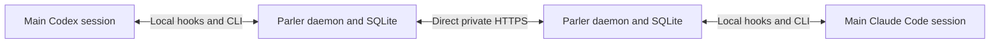

# Parler

Private communication between main Codex and Claude Code sessions on machines you own. One daemon per host provides durable mailboxes, searchable session discovery, acknowledgments, retry delivery, and copied file attachments. Hooks announce mail; the CLI reads it and sends explicit requests or results.



Parler has no hosted broker, storage service, or discovery service. Its default LAN mode excludes relay transport; explicit Tailscale mode permits encrypted Tailscale relay fallback. Daemons connect directly to explicitly paired peers, with pinned TLS certificates and peer credentials. When a peer is unavailable, persisted outgoing messages retry until their TTL expires. The sender and recipient daemons retain their own verified attachment copies, so a recipient can export a deliverable after the sender goes offline.

Only the main agent coordinates Parler. Subagents do assigned work and return their results to their parent; they do not enroll, discover sessions, send messages, or consume the parent's mailbox. The repository's [AGENTS.md](AGENTS.md) and [CLAUDE.md](CLAUDE.md) describe this policy. Hook adapters ignore identifiable subagent events and registration rejects explicit subagent roles. These workflow controls do not isolate processes running as the same operating-system user from that user's credentials.

## Requirements and setup

- Linux with `/proc` mounted. Safe workspace attachment export currently uses Linux directory file descriptors through `/proc/self/fd`.
- Node.js **24 or later**, including its built-in SQLite module.
- `openssl` on `PATH`, for generating each host's TLS certificate.
- Direct private IP connectivity between the hosts, with the chosen TCP port reachable.

Parler has no npm dependencies. Clone it on each host:

```bash
git clone git@github.com:kerbinagent/parler.git
cd parler
node bin/parler.mjs --help
```

The examples below run from the clone directory. From another directory, use the absolute path to `bin/parler.mjs`. Optionally run `npm link` yourself to expose `parler`, `parlerd`, and `parler-hook` on your `PATH`; no installation is required for the `node bin/...` commands.

Use **one persistent, absolute state directory per host**, shared by its main sessions across projects. Set the same variable in each terminal that runs Parler commands:

```bash
export PARLER_STATE="$HOME/.local/state/parler"
```

`--state /absolute/path` overrides `PARLER_STATE`. The fallback is `.parler` in the current directory, which is useful for isolated experiments but easy to split accidentally across projects. State contains local secrets, session bindings, SQLite mailboxes, and attachment copies. Parler creates private state directories and credential files; keep the state out of version control.

## Install into local Codex and Claude Code

Run this from the clone in a normal terminal. For a host on Tailscale:

```bash
node scripts/install-local.mjs --network-mode tailscale --listen "$(tailscale ip -4)"
```

For LAN-only operation, use `--network-mode private --listen YOUR_LAN_IP` instead. Add `--dry-run` to inspect the changes first. Node 24+ and OpenSSL must already be installed. This initializes `~/.local/state/parler`, installs commands in `~/.local/bin`, and merges user-level hooks into `~/.codex/hooks.json` and `~/.claude/settings.json` (honoring `CODEX_HOME` and `CLAUDE_CONFIG_DIR`). Existing settings and hooks are preserved, changed files are backed up, and rerunning the same installation is idempotent. It refuses to overwrite unrelated commands or silently change an existing state's listener policy. Keep the clone at its installed path.

The installed wrappers pass the fixed state path automatically. Ensure `~/.local/bin` is on `PATH`, or use the full path. The installer leaves the daemon stopped. Start it outside the agent sandbox and keep the terminal open:

```bash
~/.local/bin/parler daemon
```

In another terminal, run `~/.local/bin/parler info`. Restart or resume client sessions to load the hooks. In Codex, open `/hooks` and review/trust the five Parler hooks before they can run. Existing hook trust is preserved. No client model calls or trust bypass are part of installation. Pair each host in both directions using the steps below; installation alone does not establish peer credentials.

## Start two hosts

Choose each host's actual private LAN address (or use its literal Tailscale IP with `--network-mode tailscale`). These example addresses must be replaced if they do not belong to your machines. Initialize once on **host A**:

```bash
node bin/parler.mjs init --label workstation --listen 192.168.1.10 --port 7743
```

Initialize once on **host B**:

```bash
node bin/parler.mjs init --label research-box --listen 192.168.1.11 --port 7743
```

In a separate terminal on **each host**, set `PARLER_STATE` and leave the daemon running:

```bash
export PARLER_STATE="$HOME/.local/state/parler"
node bin/parler.mjs daemon
```

Back in your command terminal on each host:

```bash
node bin/parler.mjs info
```

Record each `node_id` and `endpoint`. Use those actual IDs wherever `NODE_A` or `NODE_B` appears below. The default listener is loopback, so supplying a reachable private LAN address during initialization matters for communication between hosts. Keep the Unix socket path reasonably short; the daemon rejects paths longer than 100 bytes.

## Pair the hosts

An invitation is directional: A exports an invitation addressed to B, and B imports it to authenticate connections to A. Repeat in the reverse direction for two-way messaging and discovery.

On **host A**:

```bash
node bin/parler.mjs peer export --for 'NODE_B' --output "$PARLER_STATE/invite-for-b.json"
```

On **host B**:

```bash
node bin/parler.mjs peer export --for 'NODE_A' --output "$PARLER_STATE/invite-for-a.json"
```

Each file contains a secret credential and is created with mode `0600`. Exchange these files over a secure direct LAN connection, such as SSH/SCP to the hosts' literal private LAN addresses. Put `invite-for-b.json` in B's private state directory and `invite-for-a.json` in A's, preserving `0600` permissions. Do not publish invitation contents or send them through a cloud service.

On **host A**, import B's invitation:

```bash
node bin/parler.mjs peer import "$PARLER_STATE/invite-for-a.json"
node bin/parler.mjs peer list
```

On **host B**, import A's invitation:

```bash
node bin/parler.mjs peer import "$PARLER_STATE/invite-for-b.json"
node bin/parler.mjs peer list
```

For the paired peer, both `paired_incoming` and `paired_outgoing` should be true. Repeat pairing for every host pair that needs direct communication; Parler does not forward messages through an intermediate host. CLI output omits credential tokens.

## Enroll and discover main sessions

Hooks can register native sessions automatically; manual registration also works. Use the real native main-session ID from the client, and an existing absolute workspace directory. Codex CLI environments may expose `CODEX_THREAD_ID`; hook input carries each client's `session_id`.

On **host A**, register the main Codex session:

```bash
node bin/parler.mjs session register --client codex --native-id 'CODEX_NATIVE_ID' \
  --workspace '/ABSOLUTE/PATH/TO/implementation-workspace' --title 'Widget implementation'
```

On **host B**, register the main Claude Code session:

```bash
node bin/parler.mjs session register --client claude-code --native-id 'CLAUDE_NATIVE_ID' \
  --workspace '/ABSOLUTE/PATH/TO/research-workspace' --title 'Widget research'
```

Each result contains an `address` of the form `node_id/session_id`. Use A's returned address as `A_ADDRESS` and B's as `B_ADDRESS` below. Registration persists a separate local credential binding for each client kind and native session ID. Re-registering the same native session resumes it.

On **host B**, publish searchable metadata:

```bash
node bin/parler.mjs --session 'B_ADDRESS' session update \
  --title 'Widget research' --task-summary 'Research widget storage options' \
  --project-label widget --tag research
```

On **host A**, find candidates:

```bash
node bin/parler.mjs --session 'A_ADDRESS' sessions --query 'widget research' --refresh
```

Advertisements include client kind, title, task summary, project label, presence, and freshness. `--refresh` fetches current snapshots from paired peers; background announcements also maintain the directory. The main agent chooses the intended candidate and sends to its stable address. There is no automatic natural-language title dispatch: ambiguous results require choosing among candidates. Filters include `--client-kind`, `--project`, and `--peer`.

Use `--session ADDRESS` or `--session NATIVE_ID --client codex|claude-code` explicitly when multiple sessions exist. The CLI can also resolve `PARLER_SESSION` or supported client native-ID environment variables, and otherwise accepts exactly one binding. It rejects ambiguity rather than selecting by working directory; concurrent sessions in one project remain distinct.

Each host retains at most 256 enrolled session records by default. At capacity, registration can retire the oldest explicitly closed session only when it has no retained mail or active transfer reservation; otherwise it returns a capacity error. Close unused sessions with `session close` and allow their retained mail to expire. If a retired native session resumes, its next `SessionStart` enrolls it anew with a new Parler address and refreshes its local binding.

## Request research and return a Markdown attachment

All uppercase IDs in these commands are placeholders for returned values. `REQUEST_ID` is the request's `id`; `RESULT_ID` is the result's `id`. Each `receive` response contains a `messages` array with `from`, `body`, `attachments`, `delivery_token`, and retention timestamps.

On **host A**, send the request:

```bash
node bin/parler.mjs --session 'A_ADDRESS' send --to 'B_ADDRESS' --kind request \
  --text 'Research widget storage options. Return a Markdown report with sources.'
```

The returned receipt means the outgoing message is durably queued. Track delivery with:

```bash
node bin/parler.mjs --session 'A_ADDRESS' status --message 'REQUEST_ID'
```

On **host B**, receive and accept the request:

```bash
node bin/parler.mjs --session 'B_ADDRESS' receive --wait-seconds 10
node bin/parler.mjs --session 'B_ADDRESS' ack --message 'REQUEST_ID' \
  --delivery-token 'REQUEST_DELIVERY_TOKEN'
```

Use the actual `from` address as the reply destination. Acknowledging acceptance of the request does not report that research is complete. The main agent may delegate research locally, collect its subagents' results, and write `research.md` in its research workspace. Then **host B's main session** sends the report:

```bash
node bin/parler.mjs --session 'B_ADDRESS' send --to 'A_ADDRESS' --kind result \
  --reply-to 'REQUEST_ID' --text 'Research complete; the report is attached.' \
  --attach '/ABSOLUTE/PATH/TO/research-workspace/research.md'
```

`--reply-to` automatically inherits the original conversation ID. `--attach research.md` also works when the CLI's current directory contains the file; attachment paths resolve from that current directory. The daemon stores an immutable copy instead of a pointer to the source file, and the recipient sees the result only after all attachment bytes are verified and committed.

On **host A**, receive, export, and acknowledge the result:

```bash
node bin/parler.mjs --session 'A_ADDRESS' receive --wait-seconds 10
node bin/parler.mjs --session 'A_ADDRESS' attachments list --message 'RESULT_ID'
node bin/parler.mjs --session 'A_ADDRESS' attachments export --message 'RESULT_ID' \
  --attachment 'ATTACHMENT_ID' --output 'deliverables/research.md'
node bin/parler.mjs --session 'A_ADDRESS' ack --message 'RESULT_ID' \
  --delivery-token 'RESULT_DELIVERY_TOKEN'
```

Take `ATTACHMENT_ID` from the received result or attachment manifest, and take the delivery token from `receive`. Export is relative to the **registered session workspace**, creates parent directories, rejects traversal and symlinks, and refuses to overwrite existing files. The CLI verifies size and SHA-256 again. Receive leases last 60 seconds by default; unacknowledged messages become available again after the lease expires. Save returned IDs and tokens so you can acknowledge handled messages without another receive call.

## Hook integration

Use the [Codex template](examples/hooks/codex.json) or [Claude Code template](examples/hooks/claude-code.json), replacing their absolute path placeholders. Follow the [hook setup and trust instructions](docs/hooks.md) for the selected client; the repository does not install hooks automatically. Codex requires review and trust of the exact hook definitions through its normal `/hooks` flow.

Hooks enroll main sessions, touch presence, and announce validated pending message IDs at startup, prompt, and tool boundaries. A Stop hook can request one bounded continuation to inspect new mail. Peer titles, bodies, and files are never inserted into lifecycle control context; the main agent retrieves them through CLI output and treats them as external data. Invalid input or daemon downtime preserves the client's normal flow.

Hooks **cannot wake a session that is already idle**. Incoming mail remains stored until its next lifecycle event or an explicit CLI poll. Push controllers and MCP adapters are not implemented in this version.

## Limits and retention

| Default | Value |
| --- | ---: |
| Attachment size per file | 10 MiB |
| Total attachment bytes per message | 32 MiB |
| Attachments per message | 8 |
| Physical attachment storage per host | 1 GiB |
| Retained logical attachment bytes per session | 256 MiB |
| JSON message envelope | 64 KiB |
| Message TTL | 24 hours |
| Maximum message TTL | 7 days |
| Attachment retention | 7 days after acknowledgment or expiry |
| Receive lease | 60 seconds |

Inspect each message's `retain_until` for its actual retention deadline. Reservations and retained attachments count against storage quotas. Maintenance removes expired retained records and unreferenced attachment copies. Set `--ttl-seconds` when sending to change a message's TTL within the supported maximum. These defaults live in `src/common.mjs`; persisted host settings live in private `config.json` and are validated at daemon startup. Transfer limits can be lowered but cannot exceed the v0 protocol maxima.

## Private-network boundary

The default `private` mode accepts **literal private LAN IP addresses**: RFC 1918 IPv4 and supported private IPv6, plus loopback for local testing. It rejects Tailscale addresses. DNS names, public IPs, wildcard listeners, credentials in URLs, redirects, and HTTP proxies are rejected in both modes.

Explicit `--network-mode tailscale` additionally admits the Tailscale IPv4 range `100.64.0.0/10` and IPv6 range `fd7a:115c:a1e0::/48`. Use the host's `tailscale ip -4` value as its listener and pair literal tailnet endpoints. This mode allows direct, peer-relayed, and cloud DERP-relayed Tailscale connections. Tailscale keeps those connections end-to-end encrypted; Parler also retains its pinned TLS and directional credentials. It is an explicit relaxation of the default no-cloud-transport policy. See [Tailscale connection types](https://tailscale.com/docs/reference/connection-types).

Parler uses direct application sockets with no hosted Parler mailbox or fallback service. In private mode, ensure host routing/firewalls keep endpoints on approved private paths; address syntax cannot prove the operating-system route. In Tailscale mode, ensure your tailnet policy permits the selected hosts and TCP port. Messages stay queued when the connection fails.

Private transport is separate from model inference. Once Codex or Claude Code reads a message or attachment through a tool, that content can become input to the client's configured model service. Parler does not make cloud-backed inference local.

## Development and verification

```bash
npm test
npm run check
```

The automated suite exercises storage, transfer validation, local session isolation, hook behavior, and five integration scenarios using local daemon instances. Integration coverage includes Codex/Claude discovery and Markdown exchange across two daemon instances, independent recipient attachment copies after sender shutdown, retries and deduplication, authentication/ownership rejection, size and integrity checks, and quota handling. Tests do not launch live Codex or Claude Code clients or claim a production multi-host deployment has been exercised.

See the [protocol](docs/protocol-v0.md), [attachment design](docs/attachments-v0.md), [discovery design](docs/discovery-v0.md), and [hook guide](docs/hooks.md) for further detail.
