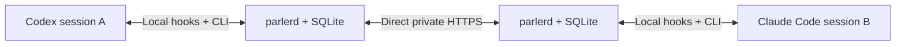

# Parler

Proposed communication protocol for Codex, Claude Code, and other tool-capable agent sessions on user-owned machines in a private network, including machines enrolled in the same Tailscale tailnet. Session messages must never traverse a cloud server.

Run one `parlerd` daemon on each machine. Each daemon stores session mailboxes and immutable attachment copies, and forwards them to explicitly paired peers. Local lifecycle hooks register sessions and notify agents of pending messages; a shared CLI handles read/send/reply/ack and attachment export. MCP tools and automatic-delivery controllers are optional later integrations.

The first version should support session registration, peer pairing, durable send/receive/reply with attachments, acknowledgments, and offline retries over direct private endpoints. There is no hosted broker, storage, discovery, or relay. Multiple sessions can share a host, and multiple paired hosts can communicate directly. Later adapters can deliver messages automatically through Codex app-server or Claude Code channels/Agent SDK integrations where supported.

Each daemon advertises enrolled Codex and Claude Code sessions to paired hosts with their title, short task description, project label, and presence. Searching for “the session working on X” returns candidates with stable addresses and freshness information; ambiguous matches are resolved before sending. Advertisements use the same private peer connections as messages.

A research assistant can return `research.md` attached to a result message. The sender's daemon keeps a copy, transfers it to the recipient's daemon, and exposes the message only when the complete attachment is stored and verified. The recipient can export the Markdown into its workspace even if the sender later goes offline or removes the original file.

Proposed defaults: 10 MiB per attachment, 32 MiB total attachments per message, up to 8 files, and 1 GiB of daemon attachment storage per host.

Hooks check mail at session/prompt/tool boundaries and can request one bounded continuation before a turn stops. A message arriving after the session is already idle waits for the next lifecycle event unless a separate push/controller adapter is enabled.

Ordinary Tailscale connections can fall back to cloud DERP relays. Tailnet membership alone does not meet this project's transport requirement. The default proposal uses LAN/private routed endpoints; any tailnet transport must first prove that cloud relay fallback is blocked.

See [the protocol proposal](docs/protocol-v0.md), [attachment delivery](docs/attachments-v0.md), and [session discovery](docs/discovery-v0.md) for the detailed design.

Status: design proposal; no executable implementation yet.
