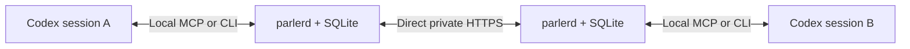

# Parler

Proposed communication protocol for Codex sessions on machines in a private network, including machines enrolled in the same Tailscale tailnet. Session messages must never traverse a cloud server.

Run one `parlerd` daemon on each machine. Each daemon stores session mailboxes, forwards messages to explicitly paired peers, and exposes local tools that Codex can call through MCP or a CLI.

The first version should support session registration, peer pairing, durable send/receive/reply, acknowledgments, and offline retries over direct private endpoints. There is no hosted broker, storage, discovery, or relay. A later adapter can deliver messages automatically to sessions managed by Codex app-server.

Ordinary Tailscale connections can fall back to cloud DERP relays. Tailnet membership alone does not meet this project's transport requirement. The default proposal uses LAN/private routed endpoints; any tailnet transport must first prove that cloud relay fallback is blocked.

See [the protocol proposal](docs/protocol-v0.md) for message semantics, tool interfaces, and implementation milestones.

Status: design proposal; no executable implementation yet.
