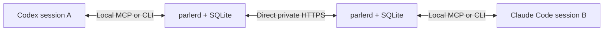

# Parler

Proposed communication protocol for Codex, Claude Code, and other tool-capable agent sessions on user-owned machines in a private network, including machines enrolled in the same Tailscale tailnet. Session messages must never traverse a cloud server.

Run one `parlerd` daemon on each machine. Each daemon stores session mailboxes, forwards messages to explicitly paired peers, and exposes shared local MCP tools or a CLI. Agent-specific adapters handle session lifecycle and optional automatic delivery.

The first version should support session registration, peer pairing, durable send/receive/reply, acknowledgments, and offline retries over direct private endpoints. There is no hosted broker, storage, discovery, or relay. Multiple sessions can share a host, and multiple paired hosts can communicate directly. Later adapters can deliver messages automatically through Codex app-server or Claude Code channels/Agent SDK integrations where supported.

Ordinary Tailscale connections can fall back to cloud DERP relays. Tailnet membership alone does not meet this project's transport requirement. The default proposal uses LAN/private routed endpoints; any tailnet transport must first prove that cloud relay fallback is blocked.

See [the protocol proposal](docs/protocol-v0.md) for message semantics, tool interfaces, and implementation milestones.

Status: design proposal; no executable implementation yet.
